# 👨🏽‍💻 Patrones de diseño

Este repositorio proporciona ejemplos prácticos de los 23 patrones de diseño.

## 🎨 Patrones creacionales

Su objetivo es proporcionar mecanismos para crear objetos de forma flexible y reutilizable. Estos patrones ofrecen mayor
flexibilidad y control sobre la creación de objetos, lo que resulta en un código más modular y adaptable a cambios.
Además, pueden mejorar el rendimiento al evitar la creación innecesaria de objetos.

## Definicion - Ventajas - Desventajas

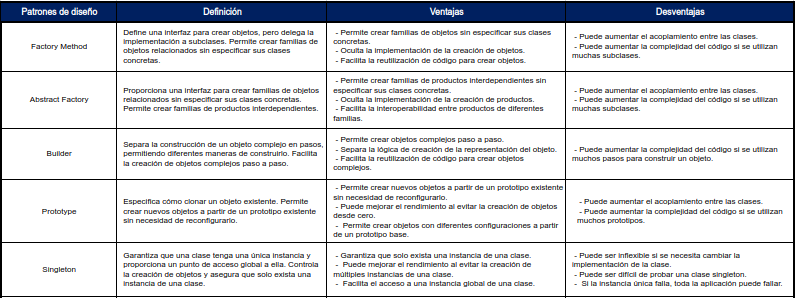

### 📋 Tipos

### Factory Method

#### 📝 Diagrama de clases

### Abstract Factory

#### 📝 Diagrama de clases

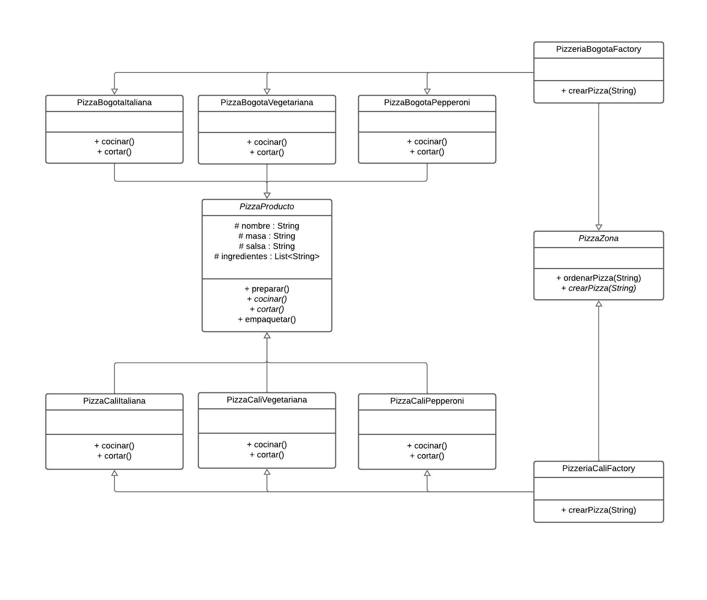

### Builder

#### 📝 Diagrama de clases

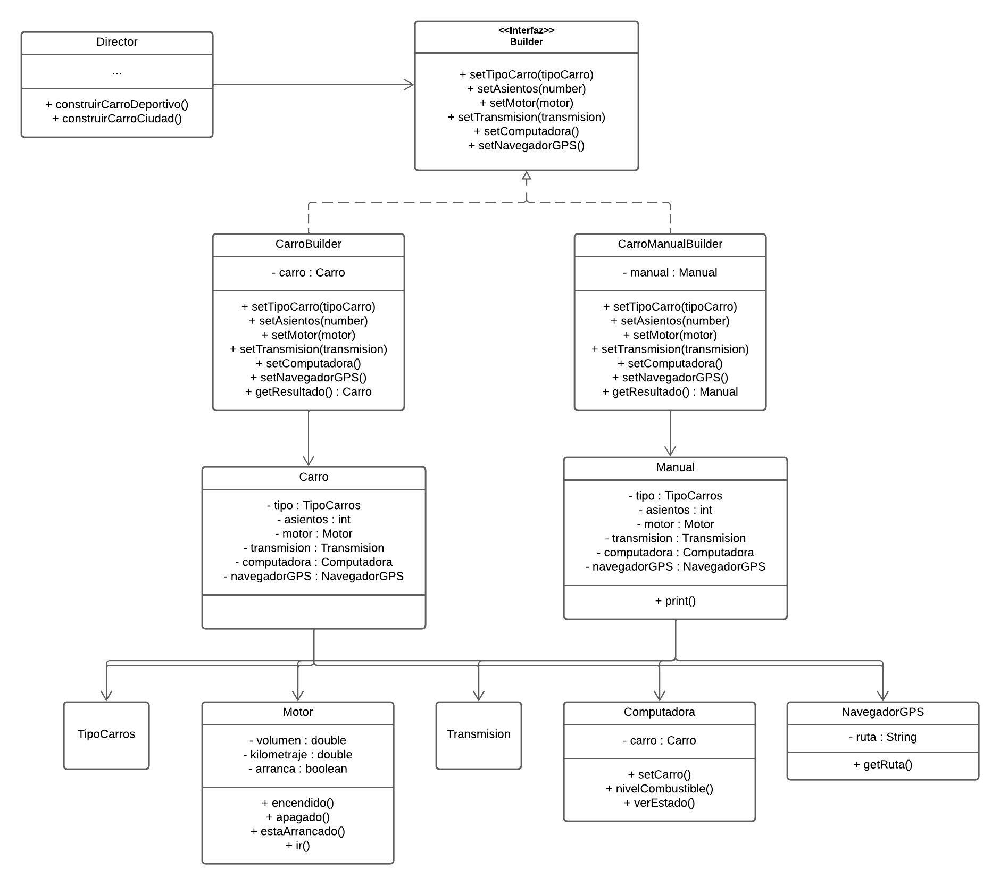

### Prototype

#### 📝 Diagrama de clases

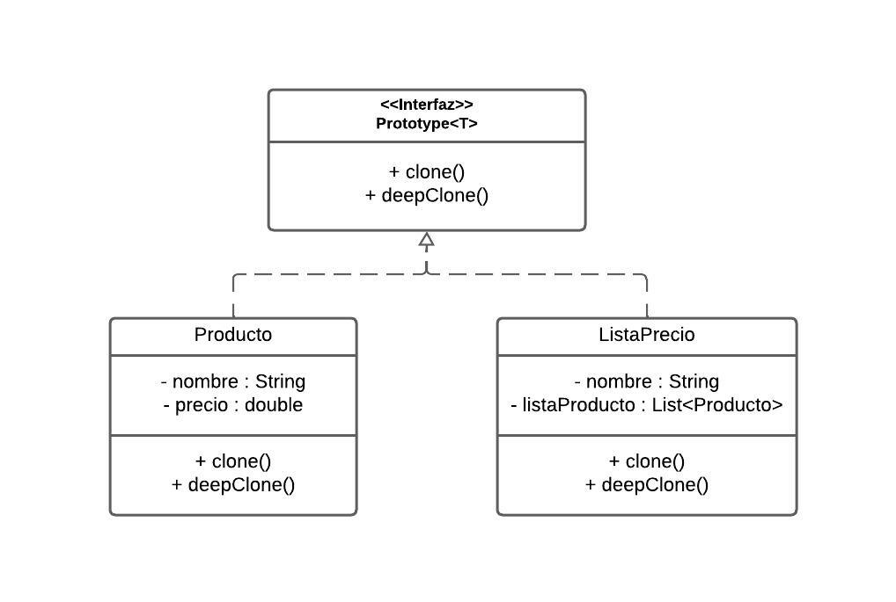

### Singleton

#### 📝 Diagrama de clases

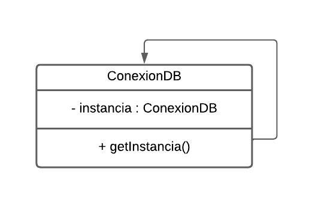

## 🏛️ Patrones extructurales

Su objetivo es organizar y componer objetos de forma eficiente y flexible. Estos patrones aumentan la claridad y la
flexibilidad en la estructura del código, lo que facilita la reutilización de código y la colaboración entre
desarrolladores. También pueden mejorar la mantenibilidad y la extensibilidad del código.

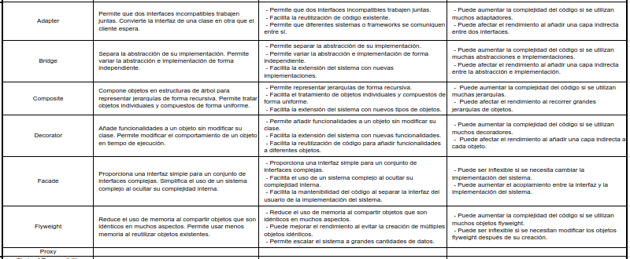

### 📋 Tipos

### Adapter

#### 📝 Diagrama de clases

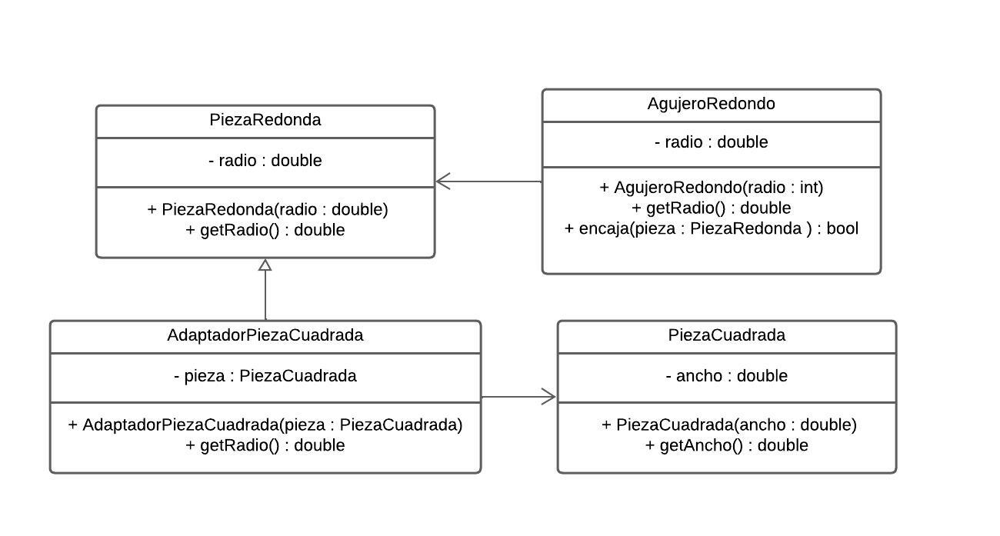

### Bridge

#### 📝 Diagrama de clases

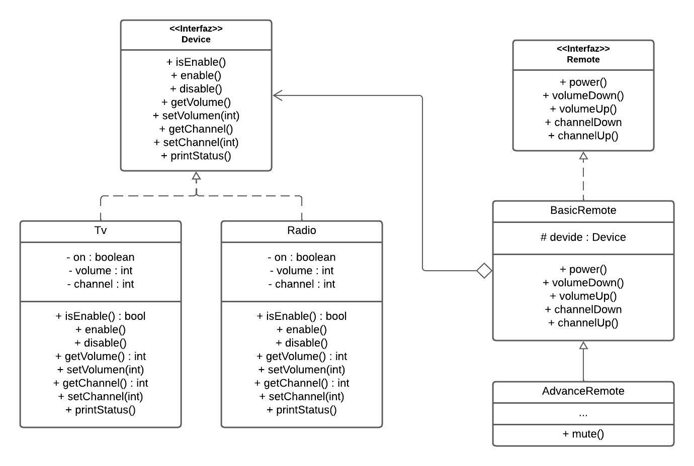

### Composite

#### 📝 Diagrama de clases

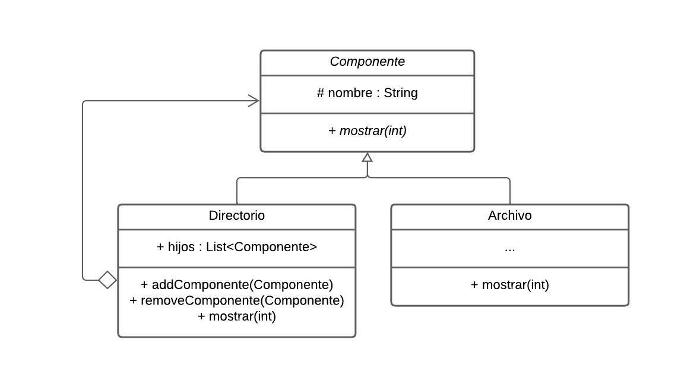

### Decorator

#### 📝 Diagrama de clases

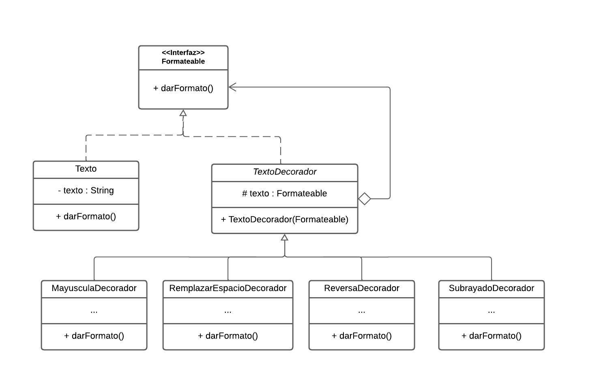

### Facade

#### 📝 Diagrama de clases

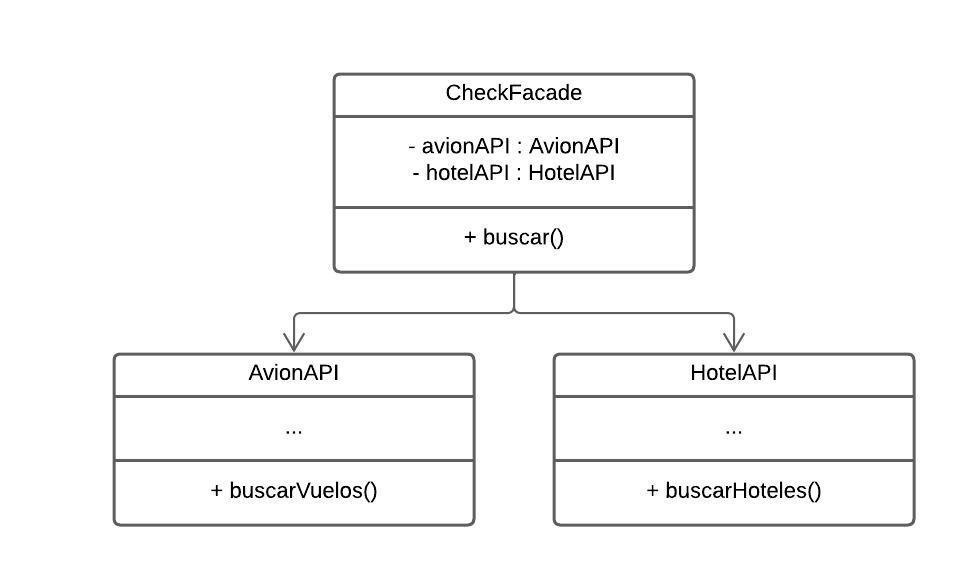

### Flyweight

#### 📝 Diagrama de clases

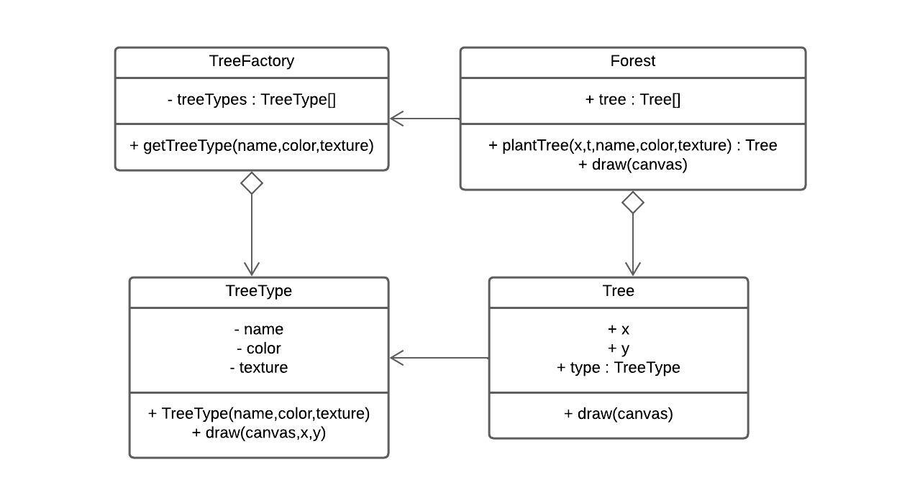

### Proxy

#### 📝 Diagrama de clases

## 🚸 Patrones de comportamiento

Su objetivo es definir cómo los objetos interactúan y colaboran entre sí. Estos patrones hacen que el código sea más
flexible y adaptable a cambios en los requisitos. Además, facilitan la comunicación y el intercambio de información
entre objetos, mejorando la modularidad y la reutilización del código.

### 📋 Tipos

### Chain of Responsibility

#### 📝 Diagrama de clases

### Command

#### 📝 Diagrama de clases

### Iterator

#### 📝 Diagrama de clases

### Mediator

#### 📝 Diagrama de clases

### Memento

#### 📝 Diagrama de clases

### Observer

#### 📝 Diagrama de clases

### State

#### 📝 Diagrama de clases

### Strategy

#### 📝 Diagrama de clases

### Template Method

#### 📝 Diagrama de clases

### Visitor

#### 📝 Diagrama de clases

